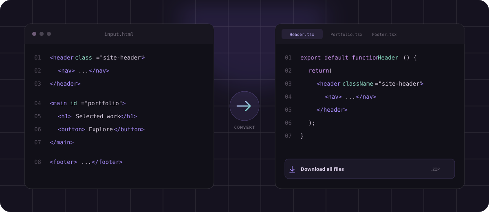
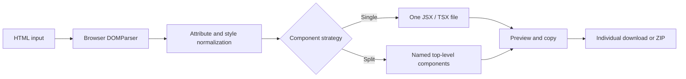

<div align="center">
  
  <h1>MarkupShift</h1>
  <p><strong>An open source HTML-to-React component converter.</strong></p>
  <p>
    Paste a layout, choose JSX or TSX, split it into meaningful files,<br />
    and download clean React components — entirely in your browser.
  </p>

  <p>
    <a href="https://markupshift.js.org/"><strong>Try MarkupShift →</strong></a>
  </p>

  <p>
    <a href="https://markupshift.js.org/">
      
    </a>
  </p>

  <p>
    <a href="https://github.com/malopestorres/markupshift/actions/workflows/pages.yml"></a>
    <a href="./LICENSE"></a>
    <a href="https://github.com/malopestorres/markupshift/issues"></a>
    <a href="https://github.com/malopestorres/markupshift/pulls"></a>
  </p>
</div>

<br />

<a href="https://markupshift.js.org/">
  
</a>

## Why MarkupShift?

Moving static markup into React is repetitive and easy to get wrong. HTML attributes need React equivalents, CSS strings need JavaScript objects, void elements need self-closing tags, and larger layouts often need to be separated into individual files.

MarkupShift handles that mechanical work while keeping the generated code readable and predictable. It is intentionally local-first: there are no accounts, uploads, API keys, or server-side processing.

## Features

| Capability | Result |
| --- | --- |
| **JSX or TSX output** | Switch languages without repasting the source |
| **React-safe attributes** | Converts `class` → `className`, `for` → `htmlFor`, and more |
| **Inline style conversion** | Turns CSS strings into React style objects |
| **Smart file splitting** | Creates one component per top-level element |
| **Predictable naming** | Infers names from `data-component`, `id`, class, or semantic tag |
| **Flexible downloads** | Download one file or every component in a ZIP |
| **Fragment validation** | Rejects full documents and explains what should be pasted |
| **Private by design** | Pasted HTML never leaves the browser |

## From HTML to components

```html
<header class="site-header">...</header>
<main id="portfolio">...</main>
<footer>...</footer>
```

```text
markupshift-components/
├── SiteHeader.tsx
├── Portfolio.tsx
├── Footer.tsx
└── index.ts
```

Generated component:

```tsx
import type React from "react";

export default function SiteHeader(): React.JSX.Element {
  return (
    <header className="site-header">
      ...
    </header>
  );
}
```

## Creating multiple components

The **Split top-level elements** strategy creates one component for each HTML element at the first level of the pasted fragment. It does not split nested children automatically.

For example, this input has only one top-level element:

```html
<div class="content">
  <h1>Hello</h1>
  <p>Welcome to the page.</p>
  <ul class="actions">
    <li><a href="#next">Next</a></li>
  </ul>
</div>
```

```text
div                    ← top-level element
├── h1                 ← nested child
├── p                  ← nested child
└── ul                 ← nested child
```

It produces one component because the heading, paragraph, and list all belong to the same parent `<div>`.

To create multiple components, paste multiple sibling elements at the first level:

```html
<header data-component="Header">
  <nav>...</nav>
</header>

<main data-component="Hero">
  <h1>Hello, my name is Ethereal</h1>
  <p>A responsive HTML template.</p>
</main>

<footer data-component="Footer">
  <p>Released under Creative Commons.</p>
</footer>
```

```text
header                 ← top-level element
main                   ← top-level element
footer                 ← top-level element
```

This produces:

```text
markupshift-components/
├── Header.tsx
├── Hero.tsx
├── Footer.tsx
└── index.ts
```

`data-component` is optional, but it is the most predictable way to choose each filename and component name. The attribute is used only as a MarkupShift instruction and is removed from the generated JSX or TSX.

The generated `index.ts` is not another component. It is a barrel file that re-exports the generated components:

```ts
export { default as Header } from "./Header";
export { default as Hero } from "./Hero";
export { default as Footer } from "./Footer";
```

## How conversion works



No API or external service is involved. The input is parsed with the browser DOM, normalized for React, and serialized into readable component files.

## Component naming

When splitting a document, MarkupShift checks each top-level element in this order:

1. `data-component="ComponentName"`
2. Element `id`
3. First meaningful class name
4. Semantic tag such as `header`, `nav`, `main`, or `footer`
5. A numbered fallback such as `Component1`

```html
<section data-component="Hero">...</section>
<section id="pricing">...</section>
```

Produces `Hero.tsx` and `Pricing.tsx`.

## Use it

Open **[markupshift.js.org](https://markupshift.js.org/)**, paste HTML, select the output language and component strategy, then download the generated files.

Everything runs locally in the current browser tab. MarkupShift does not store or transmit the pasted markup.

Paste the visual markup that would normally live inside `<body>`:

```html
<header>...</header>
<main>...</main>
<footer>...</footer>
```

Complete documents containing `<!DOCTYPE>`, `<html>`, `<head>`, or `<body>` are rejected with a clear validation message.

## Run your own copy

```bash
git clone https://github.com/malopestorres/markupshift.git
cd markupshift
npm install
npm run dev
```

Open [http://localhost:3000](http://localhost:3000).

## Quality checks

```bash
npm run lint
npm test
npm run build
```

## Scope and limitations

MarkupShift focuses on deterministic syntax conversion. It does not infer business logic, extract repeated props, or rewrite external stylesheets. Inline event handler strings are deliberately converted into safe TODO callbacks so arbitrary pasted code is never executed.

The project currently:

- Converts HTML structure, attributes, comments, text, inline styles, and void elements
- Preserves `data-*` and `aria-*` attributes
- Supports single-component and top-level split strategies
- Accepts HTML fragments and rejects complete document wrappers
- Does not execute scripts or pasted event handlers
- Does not convert external CSS files
- Does not infer props, state, hooks, or application behavior

## Roadmap

Ideas being considered:

- Broader SVG attribute support
- Optional Prettier formatting
- Drag-and-drop HTML file input
- Configurable component naming rules
- CSS class and stylesheet assistance
- More fixtures for malformed and browser-normalized HTML

Have another idea? [Open a feature request](https://github.com/malopestorres/markupshift/issues/new?template=feature_request.yml).

## Contributing

Contributions are welcome. Good first contributions include adding HTML edge-case fixtures, expanding React attribute mappings, improving accessibility, or clarifying documentation.

Read [CONTRIBUTING.md](./CONTRIBUTING.md) before opening a pull request. For incorrect conversion output, please use the bug report template and include the smallest HTML snippet that reproduces the issue.

## Community

- [Report a bug](https://github.com/malopestorres/markupshift/issues/new?template=bug_report.yml)
- [Request a feature](https://github.com/malopestorres/markupshift/issues/new?template=feature_request.yml)
- [Browse open issues](https://github.com/malopestorres/markupshift/issues)
- [Start a discussion](https://github.com/malopestorres/markupshift/discussions)

## License

MarkupShift is open source software released under the [MIT License](./LICENSE).
